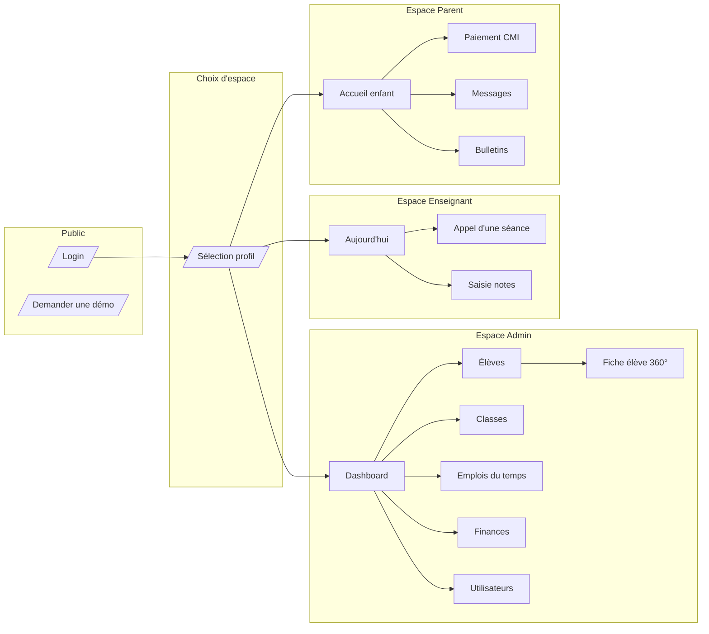

# Jawal — Maquettes (wireframes basse fidélité)

> Pack de wireframes ASCII des écrans clés du MVP. Niveau « lo-fi » volontairement : on fixe la structure, les zones, la hiérarchie d'info — pas le pixel-perfect.
> Pour le hi-fi (Figma) : produire les fichiers une fois ces wireframes validés.

**Conventions** :
- `[Bouton]` = bouton primaire · `(Bouton)` = secondaire · `‹ Lien ›` = lien
- `▸` = élément cliquable / accordéon · `▼` = sélecteur · `🔍` = recherche · `🔔` = notif
- `▒▒` = avatar/image · `═══` = bordure forte · `───` = séparation légère
- Toutes les vues sont **bilingues FR/AR** — le switch est dans le header. Affichage en `dir=rtl` quand `ar` sélectionné.

**Sommaire** :
1. [Login + sélection du contexte](#1-login--s%C3%A9lection-du-contexte)
2. [Portail admin — Dashboard direction](#2-portail-admin--dashboard-direction)
3. [Portail admin — Fiche élève 360°](#3-portail-admin--fiche-%C3%A9l%C3%A8ve-360)
4. [Portail enseignant mobile — Appel](#4-portail-enseignant-mobile--appel-pwa)
5. [Portail parent mobile — Accueil + Paiement CMI](#5-portail-parent-mobile--accueil--paiement-cmi)
6. [Bulletin trimestriel (PDF)](#6-bulletin-trimestriel-pdf)

---

## 1. Login + sélection du contexte

### 1.1 Page de login (desktop & mobile)

```
┌───────────────────────────────────────────────────────────────┐
│  🌐 FR ▼      [demo.jawal.app]                          ‹ Aide ›│
├───────────────────────────────────────────────────────────────┤
│                                                               │
│                       ▒▒▒▒▒▒▒                                 │
│                       │ Jawal │                               │
│                       ▒▒▒▒▒▒▒                                 │
│                                                               │
│              Établissement de démonstration                   │
│                                                               │
│      ┌─────────────────────────────────────────────┐          │
│      │ Email                                       │          │
│      │ vous@exemple.ma                             │          │
│      └─────────────────────────────────────────────┘          │
│      ┌─────────────────────────────────────────────┐          │
│      │ Mot de passe                              👁 │          │
│      │ ●●●●●●●●●                                   │          │
│      └─────────────────────────────────────────────┘          │
│      ☐ Se souvenir de moi      ‹ Mot de passe oublié ? ›      │
│                                                               │
│      [           Se connecter           ]                     │
│                                                               │
│      ─────────────────  OU  ─────────────────                 │
│                                                               │
│      (  G  Connexion Google Workspace  )                      │
│      (  M  Connexion Microsoft 365     )                      │
│                                                               │
│      Pas de compte ?  ‹ Demander un accès ›                   │
│                                                               │
└───────────────────────────────────────────────────────────────┘
   Footer : © 2026 Jawal · Confidentialité · CGU · Statut
```

### 1.2 Sélection de profil (si user lié à plusieurs personnes)

Cas typique : un parent rattaché à 3 enfants, ou un enseignant qui est aussi parent dans l'école.

```
┌───────────────────────────────────────────────────────────────┐
│  🌐 FR ▼     Connecté : amina.b@exemple.ma         [ Quitter ]│
├───────────────────────────────────────────────────────────────┤
│                                                               │
│  Bonjour Amina — choisissez votre espace                      │
│                                                               │
│   ┌─────────────────┐ ┌─────────────────┐ ┌─────────────────┐│
│   │ ▒▒              │ │ ▒▒              │ │ ▒▒              ││
│   │ Parent          │ │ Parent          │ │ Enseignant      ││
│   │                 │ │                 │ │                 ││
│   │ Yassine (6ème A)│ │ Salma (CE1 B)   │ │ Mathématiques   ││
│   │ ▸ Suivi enfant  │ │ ▸ Suivi enfant  │ │ ▸ Mes classes   ││
│   └─────────────────┘ └─────────────────┘ └─────────────────┘│
│                                                               │
└───────────────────────────────────────────────────────────────┘
```

---

## 2. Portail admin — Dashboard direction

```
┌─────────────────────────────────────────────────────────────────────────────────┐
│ ▒ Jawal · École de démonstration   🔍 Rechercher (Ctrl+K)   🔔 3   FR ▼   ▒ KE ▼│
├──────────┬──────────────────────────────────────────────────────────────────────┤
│ MENU     │  Tableau de bord — Année 2025-2026 ▼     [Aujourd'hui ▼]            │
│          │                                                                      │
│ 🏠 Accueil│ ┌─KPI──────────┐ ┌─KPI──────────┐ ┌─KPI──────────┐ ┌─KPI──────────┐ │
│ 👥 Élèves │ │  EFFECTIFS    │ │ ABSENTÉISME  │ │ ENCAISSEMENT │ │ EN RETARD    │ │
│ 🎓 Classes│ │     842       │ │   3,2 %      │ │  187 250 MAD │ │     47       │ │
│ 📅 EDT   │ │ ▲ +12 vs N-1  │ │ ▼ -0,8 pt    │ │ ▲ +12 % vs M-1│ │ ▲ +5 vs sem-1│ │
│ ✔ Présences│└──────────────┘ └──────────────┘ └──────────────┘ └──────────────┘ │
│ 📝 Notes │                                                                      │
│ 💬 Comm. │ ┌── Absences cette semaine ──────────┐ ┌── À traiter ───────────────┐│
│ 💳 Finances│ │                                  │ │ ▸ 12 justifications attente ││
│          │ │  L M  M J V        ◆ Absents       │ │ ▸ 3 conseils discipline    ││
│ ─────────│ │  █ █  █ █ █        ◇ Retards       │ │ ▸ 8 paiements en retard >7j││
│ ⚙ Paramètres│ │ 18 22 15 9 11                    │ │ ▸ Bulletins T1 : verrou J-3││
│ 👤 Utilisateurs│ │                                  │ └────────────────────────────┘│
│ 📊 Rapports│ │ Par classe ▼   Période 7j ▼      │                              │
│          │ └──────────────────────────────────┘ ┌── Calendrier ──────────────┐│
│          │                                       │ Conseil de classe 6èmes    ││
│          │ ┌── Effectifs par niveau ───────────┐ │   Lun 02 déc · 17h         ││
│          │ │ CP  ▓▓▓▓▓▓▓▓▓▓▓▓▓▓▓ 142          │ │                            ││
│          │ │ CE1 ▓▓▓▓▓▓▓▓▓▓▓▓▓   128          │ │ Réunion parents CM2        ││
│          │ │ ... ▓▓▓▓▓▓▓▓▓▓▓▓    122          │ │   Sam 07 déc · 9h          ││
│          │ │ 6è  ▓▓▓▓▓▓▓▓▓▓      098          │ └────────────────────────────┘│
│          │ └──────────────────────────────────┘                                │
└──────────┴──────────────────────────────────────────────────────────────────────┘
```

**Notes pour le design** :
- Cards KPI cliquables → drill-down vers la vue détaillée du module
- Le sélecteur année (haut) propage à tout le dashboard
- En `dir=rtl`, le menu passe à droite, les KPI lisent de droite à gauche, les graphes barre conservent leur axe mais l'origine est à droite

---

## 3. Portail admin — Fiche élève 360°

```
┌─────────────────────────────────────────────────────────────────────────────────┐
│ ← Élèves › Yassine Benani                              [Imprimer] [Plus ▼]      │
├─────────────────────────────────────────────────────────────────────────────────┤
│ ┌──────┐                                                                        │
│ │ ▒▒▒▒ │  Yassine BENANI                       N° élève : 2025-00342           │
│ │ ▒▒▒▒ │  Né le 12/05/2013 (12 ans)            Inscrit le 03/09/2025           │
│ └──────┘  6ème A   ◆ Présent aujourd'hui                                       │
│           Enseignant principal : Mme A. El Idrissi                              │
│                                                                                 │
│ ▸ Identité  ▸ Famille  ▸ Scolarité  ▸ Présences  ▸ Notes  ▸ Finances  ▸ Docs   │
│ ────────────────────────────────────────────────────────────────────────────── │
│                                                                                 │
│ ▼ FAMILLE (Onglet actif)                                                       │
│                                                                                 │
│  ┌─ Responsable 1 ────────────┐  ┌─ Responsable 2 ──────────────┐               │
│  │ Mère — Karima BENANI       │  │ Père — Mohamed BENANI         │               │
│  │ 📞 06 12 34 56 78          │  │ 📞 06 87 65 43 21             │               │
│  │ ✉ karima.b@exemple.ma     │  │ ✉ m.benani@exemple.ma         │               │
│  │ Compte Jawal : actif       │  │ Compte Jawal : actif          │               │
│  │ Autorisation sortie : OUI  │  │ Autorisation sortie : OUI     │               │
│  │ Personne à prévenir : OUI  │  │ Facturation principale : ✓   │               │
│  │ (Modifier)                 │  │ (Modifier)                    │               │
│  └────────────────────────────┘  └───────────────────────────────┘               │
│                                                                                 │
│  ┌─ Contact d'urgence ──────────────────────────────────────────┐               │
│  │ Grand-père — Hassan BENANI · 📞 06 11 22 33 44               │               │
│  └──────────────────────────────────────────────────────────────┘               │
│                                                                                 │
│  [+ Ajouter un responsable]   [+ Ajouter un contact d'urgence]                  │
│                                                                                 │
│ ────────────────────────────────────────────────────────────────────────────── │
│                                                                                 │
│ ▶ Activité récente                                                              │
│   · 28/05 14h32 — Note saisie en Mathématiques : 14/20 (Contrôle n°3)          │
│   · 28/05 08h15 — Présence enregistrée                                          │
│   · 27/05 17h44 — Paiement reçu : 1 500 MAD (échéance déc)                     │
│   · 25/05 09h12 — Absence justifiée : maladie (certificat joint)               │
│   ‹ Voir tout l'historique ›                                                    │
│                                                                                 │
└─────────────────────────────────────────────────────────────────────────────────┘
```

**Onglets restants (résumé)** :
- **Identité** : état civil, photo, CIN, adresse, nationalité, antécédents médicaux résumés (lien vers M14)
- **Scolarité** : parcours année par année, options, classes successives, certificats émis
- **Présences** : calendrier visuel (jours pleins/vides/justifiés), statistiques
- **Notes** : tableau matière × période avec moyennes, derniers bulletins en PDF
- **Finances** : échéancier annuel, factures, paiements, solde
- **Docs** : pièces justificatives (CIN, acte de naissance, certificats médicaux), tags

---

## 4. Portail enseignant mobile — Appel (PWA)

```
┌──────────────────────────┐  ┌──────────────────────────┐
│ ☰  Aujourd'hui     🔔 2  │  │ ←  6ème A — Maths   ✓ Tout│
├──────────────────────────┤  ├──────────────────────────┤
│ Mer 28 mai 2026          │  │ 08h00 — 09h00 · Salle A12│
│                          │  │ 24 élèves                │
│ ┌──────────────────────┐ │  │                          │
│ │ 08h00 · 6ème A       │ │  │ ┌────────────────────┐   │
│ │ Mathématiques        │ │  │ │ Yassine BENANI     │   │
│ │ Salle A12            │ │  │ │ ● Présent          │   │
│ │ ⊙ Faire l'appel  ▸  │ │  │ │ ──────────────     │   │
│ └──────────────────────┘ │  │ │ ○ Absent  ○ Retard │   │
│                          │  │ └────────────────────┘   │
│ ┌──────────────────────┐ │  │                          │
│ │ 09h00 · 6ème B       │ │  │ ┌────────────────────┐   │
│ │ Mathématiques        │ │  │ │ Salma CHERKAOUI    │   │
│ │ Salle A12            │ │  │ │ ○ Présent          │   │
│ │ ⌛ Démarre dans 50m  │ │  │ │ ● Absent           │   │
│ └──────────────────────┘ │  │ │ ○ Retard           │   │
│                          │  │ └────────────────────┘   │
│ ┌──────────────────────┐ │  │                          │
│ │ 10h15 · 5ème A       │ │  │ ┌────────────────────┐   │
│ │ Mathématiques        │ │  │ │ Omar TAZI          │   │
│ │ Salle B05            │ │  │ │ ○ Présent          │   │
│ └──────────────────────┘ │  │ │ ○ Absent           │   │
│                          │  │ │ ● Retard           │   │
│ ──────────────────────── │  │ │   12 min   ▼       │   │
│ ⊙ Notes à saisir : 2     │  │ └────────────────────┘   │
│ ⊙ Devoirs à corriger : 5 │  │                          │
│                          │  │   ... 21 élèves restants │
│ ┌──┬──┬──┬──┬──┐         │  │                          │
│ │📅│📚│✏ │💬│👤│         │  │ [   Valider l'appel   ] │
│ └──┴──┴──┴──┴──┘         │  │                          │
└──────────────────────────┘  └──────────────────────────┘
  Liste cours du jour            Saisie d'appel (golden path)
```

**Détails comportement** :
- Par défaut tous les élèves sont **Présents** → l'enseignant ne tape que les exceptions (gain de temps majeur)
- Tap "Retard" → champ "minutes" apparaît (12 min par défaut, modifiable)
- "Valider l'appel" → notifications push parents des absents dans la minute (job BullMQ)
- Mode offline : le tap est mémorisé localement, sync au retour réseau (ServiceWorker)

---

## 5. Portail parent mobile — Accueil + Paiement CMI

### 5.1 Accueil parent (mobile PWA)

```
┌──────────────────────────┐
│ ☰  Yassine ▼      🔔 2  │
├──────────────────────────┤
│                          │
│  ┌─────────────────────┐ │
│  │ ⚠ Action requise    │ │
│  │ Absence de ce matin │ │
│  │ à justifier         │ │
│  │ [  Justifier  ]     │ │
│  └─────────────────────┘ │
│                          │
│  ─── Cette semaine ───   │
│                          │
│  ┌─────────────────────┐ │
│  │ ✔ Présences  4/5    │ │
│  │ ○ ○ ○ ○ ◇           │ │
│  │ L M M J V           │ │
│  └─────────────────────┘ │
│                          │
│  ┌─────────────────────┐ │
│  │ ★ Note récente      │ │
│  │ Maths · 14/20       │ │
│  │ Moyenne classe 12,3 │ │
│  └─────────────────────┘ │
│                          │
│  ─── À venir ───         │
│                          │
│  ┌─────────────────────┐ │
│  │ 💳 Échéance déc.    │ │
│  │ 1 500 MAD           │ │
│  │ Avant le 05/12      │ │
│  │ [    Payer      ]   │ │
│  └─────────────────────┘ │
│                          │
│  ┌─────────────────────┐ │
│  │ 📚 Contrôle Histoire│ │
│  │ Vendredi 30/05      │ │
│  └─────────────────────┘ │
│                          │
│  ┌──┬──┬──┬──┬──┐        │
│  │🏠│📚│💬│💳│👤│        │
│  └──┴──┴──┴──┴──┘        │
└──────────────────────────┘
```

### 5.2 Paiement scolarité — CMI 3D Secure (parcours 4 écrans)

```
┌──────────────────────────┐  ┌──────────────────────────┐
│ ← Échéances              │  │ ← Récapitulatif paiement │
├──────────────────────────┤  ├──────────────────────────┤
│ Yassine BENANI · 6ème A  │  │                          │
│                          │  │ Échéance décembre 2025   │
│ Année 2025-2026          │  │ Scolarité 6ème A         │
│                          │  │                          │
│ ☐ Sept    1 500 MAD ✓   │  │ Montant      1 500,00 MAD│
│ ☐ Oct     1 500 MAD ✓   │  │ Frais CMI      +0,00 MAD │
│ ☐ Nov     1 500 MAD ✓   │  │ ──────────────────────── │
│ ☑ Déc     1 500 MAD     │  │ Total        1 500,00 MAD│
│ ☐ Jan     1 500 MAD     │  │                          │
│ ☐ Fév     1 500 MAD     │  │ Moyen de paiement        │
│ ☐ Mars    1 500 MAD     │  │ ● Carte bancaire (CMI)   │
│ ...                      │  │ ○ Virement (réf à venir) │
│                          │  │                          │
│ ┌──────────────────────┐ │  │ ☐ J'accepte les CGV     │
│ │ Sélectionnés : 1     │ │  │                          │
│ │ Total : 1 500 MAD    │ │  │ [  Payer 1 500 MAD  ]   │
│ │ [    Continuer  ]    │ │  │                          │
│ └──────────────────────┘ │  │ 🔒 Paiement sécurisé CMI │
└──────────────────────────┘  └──────────────────────────┘
  Choix échéances                 Récap avant CMI

┌──────────────────────────┐  ┌──────────────────────────┐
│        [LOGO CMI]        │  │ ✓ Paiement réussi        │
├──────────────────────────┤  ├──────────────────────────┤
│ Carte bancaire           │  │                          │
│ ┌──────────────────────┐ │  │      ┌──────────┐        │
│ │ 4 ●●●●  ●●●●  ●●●●   │ │  │      │    ✓     │        │
│ └──────────────────────┘ │  │      └──────────┘        │
│ ┌─────────┐ ┌─────────┐ │  │                          │
│ │ MM / AA │ │  CVV    │ │  │   Merci pour votre        │
│ └─────────┘ └─────────┘ │  │   paiement de             │
│                          │  │   1 500 MAD               │
│ Titulaire                │  │                          │
│ ┌──────────────────────┐ │  │   Réf : CMI-2025-A4F2     │
│ │ KARIMA BENANI        │ │  │                          │
│ └──────────────────────┘ │  │  [ Télécharger reçu PDF ]│
│                          │  │  [ Retour à l'accueil   ]│
│ [    Confirmer      ]    │  │                          │
│  (vous serez redirigé    │  │  📧 Reçu envoyé à        │
│   vers votre banque pour │  │     karima.b@exemple.ma  │
│   validation 3DS)        │  │                          │
└──────────────────────────┘  └──────────────────────────┘
  Page hébergée CMI               Retour app — succès
```

**Notes** :
- CMI hébergé → on ne voit JAMAIS le numéro de carte (PCI-DSS hors scope)
- Le webhook CMI confirme côté serveur, indépendamment du retour navigateur
- Le reçu PDF est généré côté serveur (asynchrone), envoyé par email + disponible dans l'app

---

## 6. Bulletin trimestriel (PDF)

Layout A4 portrait, conforme aux usages des établissements marocains (logo gauche, mention de l'AREF/MEN si autorisé, signature du chef d'établissement en bas).

```
┌─────────────────────────────────────────────────────────────────────┐
│ ┌──────┐                                                            │
│ │ LOGO │   ÉCOLE DE DÉMONSTRATION                                   │
│ └──────┘   123 Avenue Mohammed V, Casablanca · Tél : 0522 12 34 56  │
│                                                                     │
│              BULLETIN DU 1ᵉʳ TRIMESTRE — Année 2025-2026            │
│                                                                     │
├─────────────────────────────────────────────────────────────────────┤
│ Élève : Yassine BENANI                       Classe : 6ème A        │
│ N° élève : 2025-00342                        Effectif : 24          │
│ Né le : 12/05/2013                           Enseignant principal :  │
│                                              Mme A. El Idrissi      │
├─────────────────────────────────────────────────────────────────────┤
│                                                                     │
│ ┌─Matière──────┬─Coef─┬─Moy─┬─Min─┬─Max─┬─Class─┬─Appréciation────┐ │
│ │ Mathématiques│  4   │14,25│ 6,5 │17,8 │  5/24 │ Excellent travail│ │
│ │ Français     │  4   │13,00│ 7,0 │17,5 │ 8/24  │ Doit lire davant.│ │
│ │ Arabe        │  4   │15,50│ 8,0 │18,0 │ 3/24  │ Très bon trim.  │ │
│ │ Histoire-Géo │  3   │12,00│ 6,0 │16,5 │ 11/24 │ Peut mieux faire│ │
│ │ Sciences     │  3   │13,50│ 7,5 │17,0 │ 7/24  │ Sérieux et curieux│ │
│ │ Anglais      │  2   │14,00│ 8,0 │18,5 │ 6/24  │ Bonne expression│ │
│ │ Éducation isl│  2   │16,00│10,0 │19,0 │ 4/24  │ Très bien         │ │
│ │ EPS          │  1   │15,00│11,0 │18,0 │ 7/24  │ Élève motivé    │ │
│ ├──────────────┼──────┼─────┼─────┼─────┼───────┼──────────────────┤ │
│ │ MOYENNE      │      │13,87│     │     │ 6/24  │                 │ │
│ │ GÉNÉRALE     │      │     │     │     │       │                 │ │
│ └──────────────┴──────┴─────┴─────┴─────┴───────┴──────────────────┘ │
│                                                                     │
│ Moyenne classe : 12,15        Moyenne max : 16,80                   │
│ Appréciation générale du conseil de classe :                        │
│ « Bon trimestre, Yassine. Continuez vos efforts en histoire-géo. »  │
│                                                                     │
│ ┌─Vie scolaire─────────────────────────────────────────────────────┐│
│ │ Absences : 2 demi-journées (justifiées)                          ││
│ │ Retards : 1                                                      ││
│ │ Observations : —                                                 ││
│ └──────────────────────────────────────────────────────────────────┘│
│                                                                     │
│ Casablanca, le 15 décembre 2025                                     │
│                                                                     │
│      Le Chef d'établissement              L'Enseignant principal    │
│      [signature numérique]                [signature numérique]     │
│                                                                     │
│ ───────────────────────────────────────────────────────────────────│
│  Document généré par Jawal · ID vérifiable : BUL-2025-T1-00342     │
│  https://demo.jawal.app/verify/BUL-2025-T1-00342                   │
└─────────────────────────────────────────────────────────────────────┘
```

**Variante arabe** : le tableau est inversé horizontalement (matière à droite, appréciation à gauche), les chiffres restent en latin (convention au Maroc), les en-têtes et appréciations sont en arabe. Mêmes données, layout RTL.

---

## 7. Schéma de navigation global (Mermaid)



---

## 8. Notes transverses pour le hi-fi (Figma)

- **Palette** : tons sobres, contraste fort (WCAG AA min). Couleur primaire = bleu pédagogique (`#2563eb` actuel) ; secondaire à choisir avec une teinte chaleureuse (orange/terracotta) pour l'arabe (perception culturelle).
- **Typographie** : Inter pour FR/EN ; Noto Sans Arabic pour AR. Tailles : 14 base, 16 mobile, 12 dense (tableaux).
- **Iconographie** : Lucide (open source, MIT). Éviter les emoji-flag pour les langues — utiliser texte.
- **États** : prévoir empty states (« Aucun élève », « Aucune absence cette semaine ») et loading skeletons ; les écrans denses sans données sont déprimants.
- **Densité** : admin = dense (tableaux, beaucoup d'info) ; parent/enseignant mobile = aéré, gros touch targets (44px min).
- **Accessibilité** : focus visible obligatoire, labels explicites, alt sur photos, ne jamais coder l'info uniquement par la couleur (toujours doublé d'un texte ou pictogramme).
